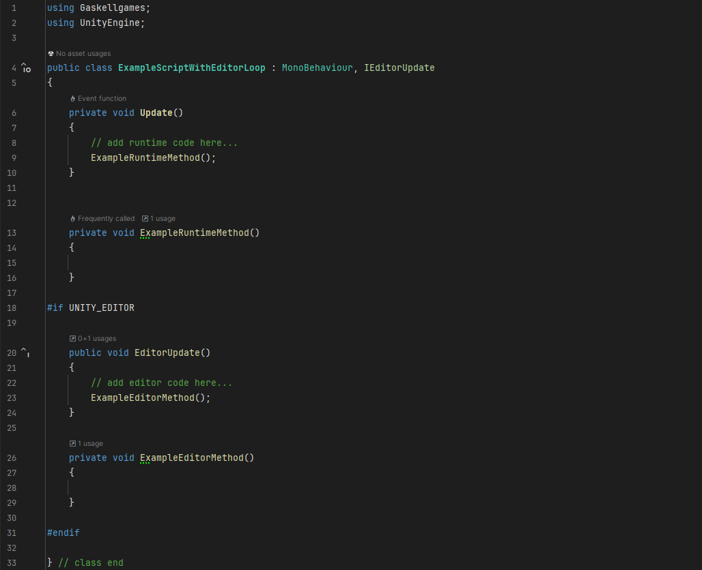

# Unity - IEditorUpdate

A custom interface that introduces a way to include an EditorUpdate loop in any components that implement IEditorUpdate, that will only execute in the editor while in edit mode.

# Why not use [ExecuteInEditMode]?

The ExecuteInEditMode attribute makes all instances of a script execute in Edit Mode, but this means that all of your runtime code will be running in the editor. This can lead to errors and warnings when runtime code should not be run until other scripts have been initilised.

By using the IEditorUpdate interface, you can cleanly seperate any editor-only code from runtime code.
